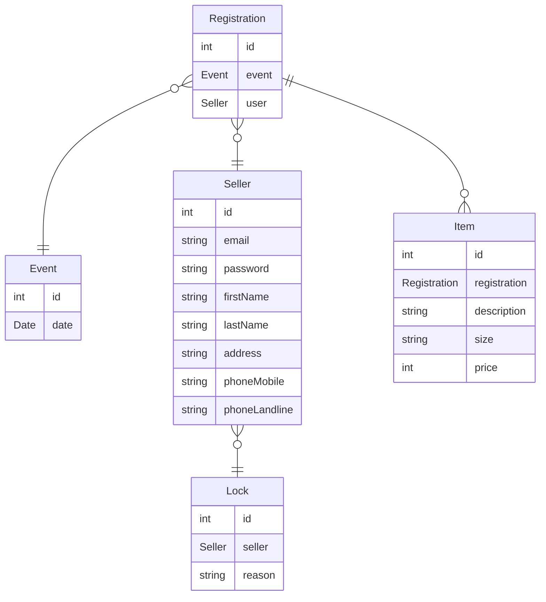

We use a Postgres database running in a Docker container.

## Getting started

After starting the database with `docker-compose up` you can access the database with any Postgres client.

Postgres is running on `localhost:5432` with the user `postgres` and the password `postgres` and the database `postgres`.

If you plan on making this a public service, you should change the password in the `docker-compose.yml` file.

## Database schema

This is the naive idea of the database schema. This is not final and will most likely change in the future.

----

